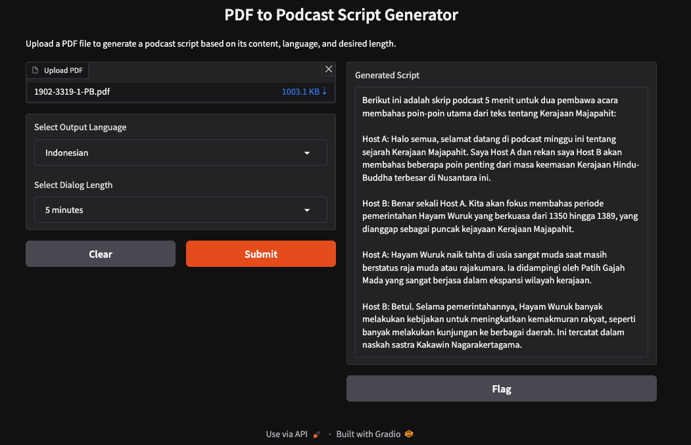

# PDF to Podcast Script Generator

This project is a PDF to Podcast Script Generator that uses OpenRouter's API to generate podcast scripts based on the content of a PDF file. The project provides a Gradio interface for users to upload a PDF, select the output language, and choose the desired length of the podcast script.

## Features

- Extracts text from a PDF file.
- Generates a podcast script based on the extracted text, language, and duration.
- Uses OpenRouter's API to generate the script.
- Provides a Gradio interface for easy interaction.

## Installation

1. Clone the repository:
   ```bash
   git clone https://github.com/yourusername/podcast_simulator.git
   cd podcast_simulator
   ```

2. Create a virtual environment and activate it:
   ```bash
   python3 -m venv venv
   source venv/bin/activate
   ```

3. Install the dependencies:
   ```bash
   pip install -r requirements.txt
   ```

4. Create a `.env` file in the root directory and add your OpenRouter API key:
   ```env
   OPENROUTER_API_KEY=your_openrouter_api_key
   ```

## Usage

1. Run the application:
   ```bash
   python podcast_simulator.py
   ```

2. Open your web browser and go to the URL provided by Gradio.

3. Upload a PDF file, select the output language, and choose the desired length of the podcast script.

4. Click the "Submit" button to generate the podcast script.

## Environment Variables

- `OPENROUTER_API_KEY`: Your OpenRouter API key for authentication.

## Dependencies

- `gradio==5.0.1`
- `PyPDF2==3.0.1`
- `requests==2.32.3`
- `openai==1.51.2`

## License

This project is licensed under the MIT License. 

## Acknowledgements

- [Gradio](https://gradio.app/)
- [PyPDF2](https://pypi.org/project/PyPDF2/)
- [OpenRouter](https://openrouter.ai/)

## Author

- Dody Rachmat Wicaksono (dody@nicecoder.com)

## Hire Me

If you are interested in hiring me for your project, please contact me at dody@nicecoder.com.


